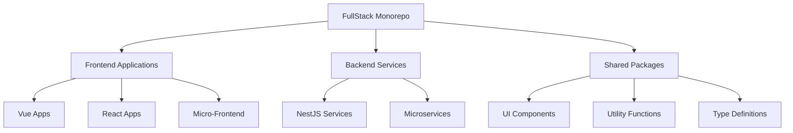

# &nbsp;

# FullStack Monorepo Project Documentation

This is a modern Monorepo full-stack development project based on Lerna + NX + PNPM Workspace, adopting a progressive development approach. It integrates multiple frontend frameworks and backend services to provide a complete full-stack development solution.

English | [简体中文](./README.md)

## Project Features

- **Unified Version Control**: All packages share the same version number, ensuring dependency consistency
- **Intelligent Build System**: Incremental builds using NX to improve development efficiency
- **Efficient Dependency Management**: PNPM Workspace-based dependency management saving disk space
- **Multi-Framework Support**: Simultaneous support for React, Vue, NestJS, and other mainstream frameworks
- **Code Sharing**: Easy sharing of components, utility functions, and type definitions
- **Unified Development Standards**: Globally consistent code style, commit conventions, and development processes

## Technology Stack

### Project Management

- Lerna: Package management tool
- NX: Intelligent build system
- PNPM Workspace: Efficient dependency management

### Frontend

- Vue 3: Reactive frontend framework
- React: Component-based frontend framework
- Micro-Frontend: Application integration solution
- TypeScript: Type safety guarantee
- Vite: High-speed build tool

### Backend

- NestJS: Enterprise-grade backend framework
- Microservices: Distributed system architecture
- TypeScript: Type safety guarantee
- Databases: MongoDB/PostgreSQL/Redis

### Engineering

- ESLint: Code quality checking
- Prettier: Code formatting tool
- Husky: Git hooks management
- Jest: Unit testing framework
- Docker: Containerized deployment

## Project Structure



## Quick Start

1. Clone the project

```bash
git clone https://github.com/w3cshare/FullStack.git
cd FullStack
```

2. Install dependencies

```bash
pnpm install
```

3. Start development services

```bash
# Start all services
./start-services.sh

# Stop all services
./stop-services.sh
```

4. Build the project

```bash
pnpm build
```

## Documentation Navigation

- [Quick Start](getting-started) - Project environment setup and basic usage
- [Architecture Design](architecture) - System architecture and technology selection
- [Directory Structure](directory-structure) - Project directory organization and description
- [Development Standards](development-standards) - Development specifications and best practices
- [Deployment Solutions](deployment) - Project deployment and operations guide
- [PNPM Workspace Guide](pnpm-workspace-guide) - PNPM Workspace usage guide

## 🤝 Contribution Guidelines

1. Fork this project
2. Create your feature branch (`git checkout -b feature/amazing-feature`)
3. Commit your changes (`git commit -m 'Add some amazing feature'`)
4. Push to the branch (`git push origin feature/amazing-feature`)
5. Open a Pull Request

## 📄 License

This project is open-source under the [LICENSE](./LICENSE.md).

## 🙏 Acknowledgments

Thanks to all developers who have contributed to this project!

## 📮 Contact Us

For any questions or suggestions, please contact us through:

- Issue: [Create Issue](https://github.com/w3cshare/FullStack.git/issues)
- Email: wwdqq7@qq.com
