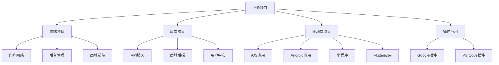

# 全栈项目汇总

> 加速数字化业务交付的全栈技术平台

本平台提供完整的企业级应用开发解决方案，集成前端、后端、DevOps等全链路技术能力，为业务系统开发提供标准化、模块化和自动化的工程实践支持，大幅提升研发效能和产品质量。

## 核心能力

- **项目丰富**：提供丰富的业务项目案例
- **移动端支持**：支持iOS、Android、小程序等移动端开发
- **插件应用**：支持浏览器插件、编辑器插件等开发
- **完整业务**：包含前后端完整业务实现
- **TypeScript**：完整的TypeScript支持
- **上线项目**：包含实际上线的业务项目

## 快速开始

1. 安装依赖

```bash
# 安装开发工具链
pnpm app:install

# 创建新项目（交互式选择技术栈与模板）
pnpm app:create my-enterprise-app

# 进入项目目录并启动开发服务
cd my-enterprise-app
pnpm dev
```

### 前端应用配置示例

```typescript
// 应用配置示例 (app.config.ts)
export default {
  // 应用基础配置
  app: {
    name: '企业级应用示例',
    logo: '/assets/logo.svg',
    theme: {
      primaryColor: '#1677ff',
      layout: 'side', // 'side' | 'top' | 'mix'
      contentWidth: 'fixed', // 'fluid' | 'fixed'
    },
  },

  // 多租户配置
  tenancy: {
    mode: 'multi', // 'multi' | 'single'
    isolationStrategy: 'schema', // 'database' | 'schema' | 'table'
    tenantIdField: 'tenant_id',
    defaultTenant: 'master',
  },

  // 权限配置
  auth: {
    type: 'oauth2',
    endpoint: '/api/auth',
    clientId: 'web-client',
    scope: 'openid profile email',
    autoRefreshToken: true,
    permission: {
      mode: 'rbac', // 'rbac' | 'abac' | 'hybrid'
      defaultRoute: '/dashboard',
    },
  },

  // API配置
  api: {
    baseUrl: '/api',
    timeout: 10000,
    retryTimes: 3,
    mockEnabled: process.env.NODE_ENV === 'development',
    errorHandler: {
      default: true,
      custom: error => {
        // 自定义错误处理逻辑
      },
    },
  },

  // 模块配置
  modules: [
    { name: 'dashboard', enabled: true },
    { name: 'user-management', enabled: true },
    { name: 'workflow', enabled: true },
    { name: 'report', enabled: true },
  ],
}
```

## 平台架构图



## 核心模块

- **多租户管理**：租户创建、配置、资源分配与隔离策略管理
- **用户身份与权限**：用户管理、角色授权、数据权限、API权限控制
- **低代码开发**：可视化设计器、表单引擎、模板引擎、工作流引擎
- **数据管理**：主数据管理、数据集成、数据建模、数据治理
- **业务流程**：BPM流程设计、任务管理、流程监控、审批中心
- **报表分析**：即席查询、数据可视化、仪表盘、数据导出
- **系统管理**：菜单配置、参数设置、操作日志、系统监控
