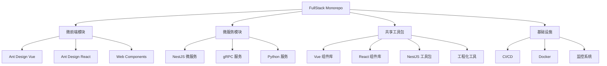

# 公司应用概览

本文档提供对公司基于 Lerna + Nx + pnpm + Workspace 构建的单体（Mono）项目的整体概览，帮助开发人员快速了解项目架构和各个核心模块。

::: tip 项目技术栈
项目采用全栈 TypeScript 开发，涵盖微前端、微服务和共享工具包。
:::

## 项目架构

公司应用基于现代化前后端分离架构，采用微前端和微服务的设计理念，通过单体仓库（Monorepo）进行统一管理：



## 微前端模块

微前端架构允许不同团队使用不同技术栈开发前端应用，同时为用户提供统一的应用体验。

### 核心特性

- 基于 Web Components 的微前端隔离
- 支持 Vue、React、Angular 等多框架集成
- 统一的基座应用和路由系统
- 微应用间通信机制
- 共享依赖和组件资源

### 主要模块

| 模块名称          | 技术栈             | 描述                      |
| ----------------- | ------------------ | ------------------------- |
| micro-app-vue     | Vue 3 + Vite       | 基于 Vue 的微应用模板     |
| micro-app-react   | React + TypeScript | 基于 React 的微应用模板   |
| micro-app-angular | Angular            | 基于 Angular 的微应用模板 |
| micro-app-web3    | React + ethers.js  | 区块链功能模块            |
| micro-app-ai      | Vue + LangChain    | AI 助手应用               |
| micro-app-vap     | Vue Admin Pro      | 管理后台模板              |

::: tip 微前端文档
更多关于微前端架构的详细信息，请查看[微前端架构设计](/micro-frontend/docs/architecture)文档。
:::

## 微服务模块

微服务架构实现了后端服务的解耦和独立部署，提高了系统的可扩展性和维护性。

### 核心特性

- 基于 NestJS 的微服务框架
- gRPC 通信协议
- Consul 服务注册与发现
- 分布式追踪和监控
- 统一的认证与授权机制

### 主要模块

| 模块名称          | 技术栈        | 描述           |
| ----------------- | ------------- | -------------- |
| grpc-main         | NestJS + gRPC | 主要 gRPC 服务 |
| grpc-client       | NestJS + gRPC | gRPC 客户端    |
| tcp-main          | NestJS + TCP  | TCP 微服务     |
| tcp-client        | NestJS + TCP  | TCP 客户端     |
| nest-template     | NestJS        | 微服务模板     |
| py-pdf-compressed | Python        | PDF 处理服务   |

::: tip 微服务文档
有关微服务架构的更多信息，请参考[微服务服务治理](/micro-service/docs/service-governance)文档。
:::

## 共享工具包

共享工具包提供了跨项目复用的组件和功能，减少代码重复并确保一致性。

### Vue 组件库

基于 Vue 3 的企业级组件库，提供丰富的 UI 组件和业务组件：

- `element-ui-lib`: 基于 Element UI 的扩展组件
- `ant-design-lib`: 基于 Ant Design Vue 的扩展组件
- `uniapp-lib`: UniApp 跨端组件
- `pure-ui-lib`: SEO 友好型组件

::: tip Vue 组件文档
详细组件用法请参考 [Vue 组件总览](/package-vue/docs/components)。
:::

### React 组件库

基于 React 的企业级组件库，提供高质量 UI 组件和业务组件：

- Ant Design Pro Components 扩展
- 数据可视化组件
- 表单与表格高级组件
- 业务定制组件

::: tip React 组件文档
详细组件用法请参考 [React 组件总览](/package-react/docs/components)。
:::

### NestJS 工具包

NestJS 相关的工具包和扩展模块：

- `nestjs-swagger`: Swagger 文档增强
- `nestjs-logger`: 日志管理模块
- `nestjs-config`: 配置管理
- `nestjs-static`: 静态资源服务
- `grpc-proto-pkg`: gRPC Proto 共享包

### 工程化工具

提高开发效率和代码质量的工程化工具：

- `commitlint-smarts`: Git 提交信息规范工具
- 自动化测试框架
- 代码生成工具
- 构建与发布脚本

## 开发流程与规范

### Git 工作流

项目采用基于 GitFlow 的工作流程：

1. `feature/*`: 功能开发分支
2. `bugfix/*`: 问题修复分支
3. `release/*`: 版本发布分支
4. `main`: 主分支，保持稳定
5. `develop`: 开发分支，集成最新特性

### 提交规范

提交信息遵循 Conventional Commits 规范，由 commitlint-smarts 工具强制执行：

```
<类型>(<可选的作用域>): <描述>

[可选的正文]

[可选的脚注]
```

::: tip 提交规范文档
详细的提交规范请参考 [提交消息正文指南](/lint/commitlint-smarts/docs/body)。
:::

### 构建与部署

项目使用 CI/CD 流水线实现自动化构建与部署：

1. 代码提交触发自动化测试
2. 通过测试后构建 Docker 镜像
3. 推送镜像到私有仓库
4. 自动或手动部署到测试/生产环境

## 下一步

- [快速开始](/docs/getting-started) - 项目环境搭建与开发入门
- [开发指南](/docs/development-guide) - 开发规范与最佳实践
- [API 文档](/docs/api) - API 接口文档
- [贡献指南](/docs/contributing) - 如何参与项目贡献
