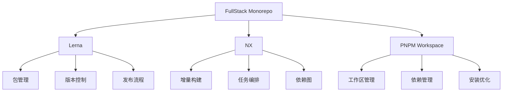
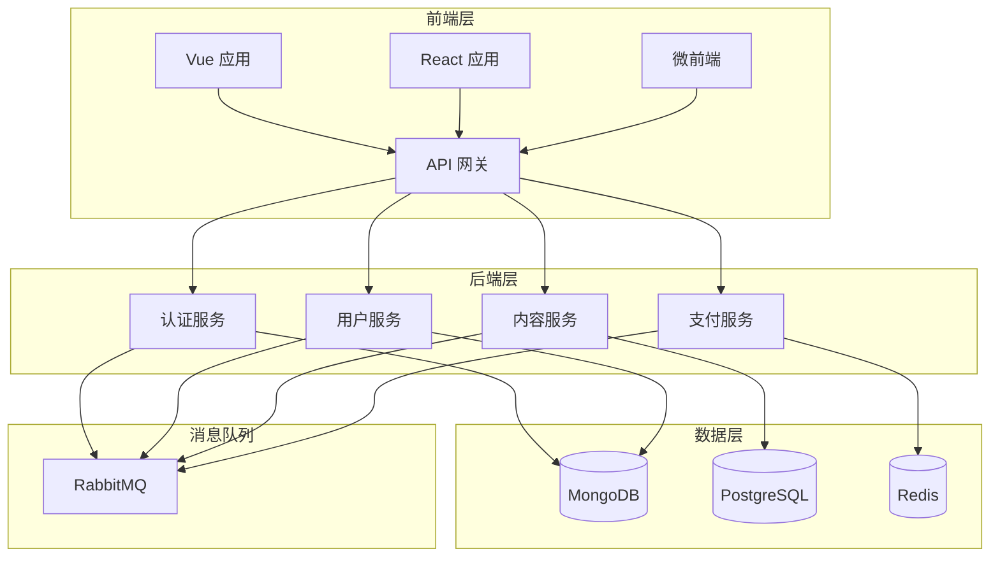
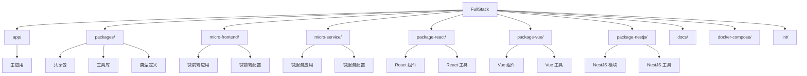
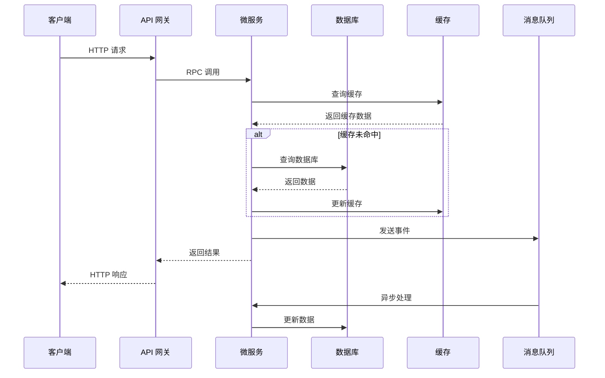
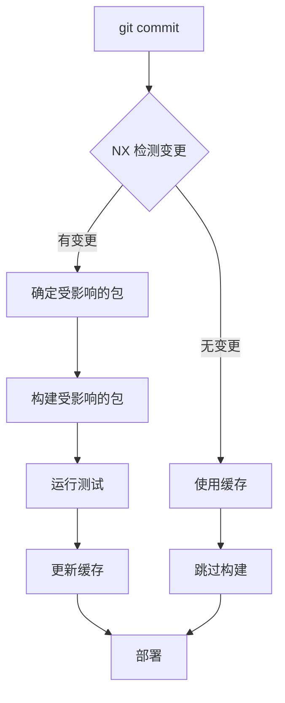
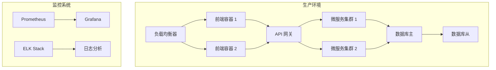
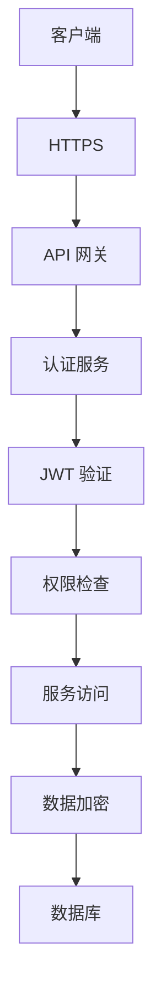
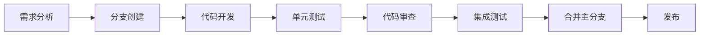

# 项目架构

FullStack Monorepo 项目采用基于 Lerna + NX + PNPM Workspace 的现代化 Monorepo 架构，集成了前端和后端的多种框架和技术，以提供完整的全栈开发解决方案。

## Monorepo 架构

### Lerna

Lerna 是一个优化基于 git 和 npm 管理多包仓库的工作流工具，它主要负责：

- **包管理**：管理项目中的多个包
- **版本控制**：统一管理版本
- **发布流程**：简化包发布过程

### NX

NX 是一个智能、快速和可扩展的构建系统，它主要负责：

- **增量构建**：只构建变更的部分
- **缓存**：缓存构建结果以提高速度
- **依赖图**：自动分析项目依赖关系
- **任务编排**：优化并行任务执行

### PNPM Workspace

PNPM 是一个快速、节省磁盘空间的包管理器，它主要负责：

- **工作区管理**：管理多包项目的工作区
- **依赖管理**：高效管理依赖关系
- **安装优化**：共享依赖以节省磁盘空间

## 应用架构

## 技术栈详解

### 前端技术栈

- **框架**

  - Vue 3：核心前端框架，基于组合式 API
  - React 18：核心前端框架，基于函数式组件和 Hooks
  - TypeScript：类型安全的 JavaScript 超集
  - Vite：现代化前端构建工具

- **UI 组件库**

  - Element Plus：基于 Vue 3 的组件库
  - Ant Design：基于 React 的组件库
  - Tailwind CSS：实用优先的 CSS 框架

- **状态管理**

  - Pinia：Vue 3 官方推荐的状态管理库
  - Redux Toolkit：React 状态管理工具

- **路由**
  - Vue Router：Vue 的官方路由
  - React Router：React 的路由解决方案

### 后端技术栈

- **框架**

  - NestJS：基于 TypeScript 的 Node.js 服务端框架
  - Express：轻量级 Node.js Web 应用框架
  - TypeScript：类型安全的 JavaScript 超集

- **数据库**

  - MongoDB：文档数据库
  - PostgreSQL：关系型数据库
  - Redis：内存数据结构存储

- **微服务**

  - gRPC：高性能 RPC 框架
  - TCP/UDP：基于 NestJS 的微服务传输

- **API 文档**
  - Swagger：API 文档生成工具
  - OpenAPI：API 规范

## 目录结构

FullStack Monorepo 的主要目录结构如下：

更详细的目录结构，请参考[目录结构说明](/docs/directory-structure)。

## 数据流

在 FullStack Monorepo 项目中，数据流如下所示：

## 构建流程

FullStack Monorepo 项目的构建流程基于 NX，实现了增量构建和缓存：

## 部署架构

项目采用基于 Docker 和 Kubernetes 的容器化部署架构：

## 安全架构

项目的安全架构如下：

## 开发流程

项目的开发流程基于 Git Flow：

## 参考资源

- [Lerna 官方文档](https://lerna.js.org/)
- [NX 官方文档](https://nx.dev/)
- [PNPM Workspace 官方文档](https://pnpm.io/workspaces)
- [Monorepo 最佳实践](https://monorepo.tools/)
