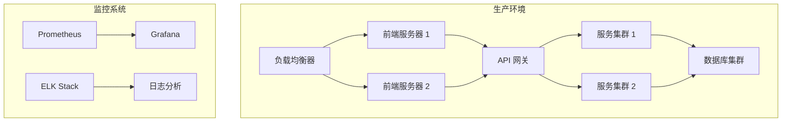

# 部署方案

## 环境要求

### 开发环境

- Node.js >= 18.0.0
- PNPM >= 8.0.0
- Docker >= 24.0.0
- Docker Compose >= 2.0.0

### 生产环境

- Kubernetes >= 1.24
- Helm >= 3.0
- Nginx >= 1.20
- MongoDB >= 6.0
- PostgreSQL >= 15.0
- Redis >= 7.0
- RabbitMQ >= 3.0

## 部署架构



## 部署流程

### 1. 环境准备

1. **安装依赖**

   ```bash
   # 安装 Node.js
   nvm install 16
   nvm use 16

   # 安装 PNPM
   npm install -g pnpm

   # 安装 Docker
   brew install docker docker-compose
   ```

2. **配置环境变量**

   ```bash
   # 复制环境变量模板
   cp .env.example .env

   # 编辑环境变量
   vim .env
   ```

3. **配置 Docker**

   ```bash
   # 启动 Docker
   open -a Docker

   # 登录 Docker Hub
   docker login
   ```

### 2. 构建应用

1. **安装依赖**

   ```bash
   # 安装项目依赖
   pnpm install
   ```

2. **构建应用**

   ```bash
   # 构建所有应用
   pnpm build

   # 构建特定应用
   pnpm build --filter=@w3cshare/w3cshare.github.io.git/vue-app
   pnpm build --filter=@w3cshare/w3cshare.github.io.git/react-app
   pnpm build --filter=@w3cshare/w3cshare.github.io.git/nestjs-service
   ```

3. **构建 Docker 镜像**

   ```bash
   # 构建所有镜像
   docker-compose build

   # 构建特定镜像
   docker-compose build vue-app
   docker-compose build react-app
   docker-compose build nestjs-service
   ```

### 3. 部署应用

#### 开发环境

1. **启动服务**

   ```bash
   # 启动所有服务
   docker-compose up -d

   # 启动特定服务
   docker-compose up -d vue-app
   docker-compose up -d react-app
   docker-compose up -d nestjs-service
   ```

2. **验证服务**

   ```bash
   # 检查服务状态
   docker-compose ps

   # 查看服务日志
   docker-compose logs -f
   ```

#### 生产环境

1. **准备 Kubernetes 集群**

   ```bash
   # 创建命名空间
   kubectl create namespace your-app

   # 创建配置
   kubectl apply -f k8s/config
   ```

2. **部署应用**

   ```bash
   # 部署所有应用
   kubectl apply -f k8s/

   # 部署特定应用
   kubectl apply -f k8s/vue-app
   kubectl apply -f k8s/react-app
   kubectl apply -f k8s/nestjs-service
   ```

3. **验证部署**

   ```bash
   # 检查部署状态
   kubectl get pods -n your-app

   # 查看部署日志
   kubectl logs -f deployment/vue-app -n your-app
   ```

## 环境配置

### 开发环境配置

1. **前端配置**

   ```javascript
   // .env.development
   VITE_API_URL=http://localhost:3000
   VITE_APP_TITLE=开发环境
   ```

2. **后端配置**
   ```javascript
   // .env.development
   DATABASE_URL=mongodb://localhost:27017/your-app
   REDIS_URL=redis://localhost:6379
   RABBITMQ_URL=amqp://localhost:5672
   ```

### 生产环境配置

1. **前端配置**

   ```javascript
   // .env.production
   VITE_API_URL=https://api.your-domain.com
   VITE_APP_TITLE=生产环境
   ```

2. **后端配置**
   ```javascript
   // .env.production
   DATABASE_URL=mongodb://mongodb:27017/your-app
   REDIS_URL=redis://redis:6379
   RABBITMQ_URL=amqp://rabbitmq:5672
   ```

## 监控和日志

### 监控配置

1. **Prometheus 配置**

   ```yaml
   # prometheus.yml
   global:
     scrape_interval: 15s
   scrape_configs:
     - job_name: 'your-app'
       static_configs:
         - targets: ['localhost:3000']
   ```

2. **Grafana 配置**
   ```yaml
   # grafana.ini
   [server]
   http_port = 3000
   root_url = %(protocol)s://%(domain)s/grafana/
   ```

### 日志配置

1. **ELK 配置**

   ```yaml
   # logstash.conf
   input {
   beats {
   port => 5044
   }
   }
   output {
   elasticsearch {
   hosts => ["elasticsearch:9200"]
   }
   }
   ```

2. **应用日志配置**
   ```javascript
   // logger.config.js
   module.exports = {
     transports: [
       new winston.transports.Console(),
       new winston.transports.File({ filename: 'error.log', level: 'error' }),
       new winston.transports.File({ filename: 'combined.log' }),
     ],
   }
   ```

## 备份和恢复

### 数据库备份

1. **MongoDB 备份**

   ```bash
   # 备份
   mongodump --uri="mongodb://localhost:27017/your-app" --out=/backup

   # 恢复
   mongorestore --uri="mongodb://localhost:27017/your-app" /backup
   ```

2. **PostgreSQL 备份**

   ```bash
   # 备份
   pg_dump -U postgres your-app > /backup/your-app.sql

   # 恢复
   psql -U postgres your-app < /backup/your-app.sql
   ```

### 文件备份

1. **配置文件备份**

   ```bash
   # 备份
   tar -czf config-backup.tar.gz /etc/your-app/

   # 恢复
   tar -xzf config-backup.tar.gz -C /etc/your-app/
   ```

2. **上传文件备份**

   ```bash
   # 备份
   rsync -av /var/www/uploads/ /backup/uploads/

   # 恢复
   rsync -av /backup/uploads/ /var/www/uploads/
   ```

## 安全配置

### SSL 配置

1. **Nginx SSL 配置**

   ```nginx
   server {
     listen 443 ssl;
     server_name your-domain.com;
     ssl_certificate /etc/nginx/ssl/your-domain.crt;
     ssl_certificate_key /etc/nginx/ssl/your-domain.key;
   }
   ```

2. **应用 SSL 配置**
   ```javascript
   // app.config.js
   module.exports = {
     ssl: {
       enabled: true,
       key: '/etc/ssl/private/your-domain.key',
       cert: '/etc/ssl/certs/your-domain.crt',
     },
   }
   ```

### 防火墙配置

1. **UFW 配置**

   ```bash
   # 允许 HTTP 和 HTTPS
   ufw allow 80/tcp
   ufw allow 443/tcp

   # 允许特定端口
   ufw allow 3000/tcp
   ```

2. **iptables 配置**
   ```bash
   # 允许 HTTP 和 HTTPS
   iptables -A INPUT -p tcp --dport 80 -j ACCEPT
   iptables -A INPUT -p tcp --dport 443 -j ACCEPT
   ```

## 性能优化

### 前端优化

1. **Nginx 配置**

   ```nginx
   # 启用 gzip
   gzip on;
   gzip_types text/plain text/css application/json application/javascript text/xml application/xml application/xml+rss text/javascript;

   # 缓存配置
   location /static/ {
     expires 1y;
     add_header Cache-Control "public, no-transform";
   }
   ```

2. **CDN 配置**
   ```html
   <!-- 使用 CDN -->
   <script src="https://cdn.jsdelivr.net/npm/vue@3"></script>
   <link rel="stylesheet" href="https://cdn.jsdelivr.net/npm/element-plus/dist/index.css" />
   ```

### 后端优化

1. **数据库优化**

   ```sql
   -- 创建索引
   CREATE INDEX idx_user_email ON users(email);

   -- 优化查询
   EXPLAIN ANALYZE SELECT * FROM users WHERE email = 'test@example.com';
   ```

2. **缓存配置**
   ```javascript
   // Redis 配置
   const redis = new Redis({
     host: 'localhost',
     port: 6379,
     maxRetriesPerRequest: 3,
     enableReadyCheck: true,
   })
   ```

## 故障恢复

### 服务恢复

1. **自动重启**

   ```yaml
   # docker-compose.yml
   services:
     app:
       restart: always
   ```

2. **健康检查**
   ```yaml
   # kubernetes/deployment.yml
   livenessProbe:
     httpGet:
       path: /health
       port: 3000
     initialDelaySeconds: 30
     periodSeconds: 10
   ```

### 数据恢复

1. **数据库恢复**

   ```bash
   # 从备份恢复
   mongorestore --uri="mongodb://localhost:27017/your-app" /backup/your-app

   # 验证数据
   mongo your-app --eval "db.users.find()"
   ```

2. **文件恢复**

   ```bash
   # 从备份恢复
   rsync -av /backup/uploads/ /var/www/uploads/

   # 验证文件
   ls -la /var/www/uploads/
   ```
