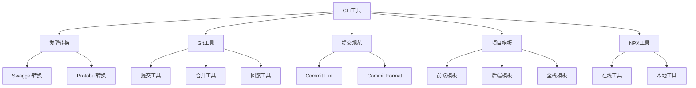

# 脚手架系统

CLI工具是一个基于Node.js的现代化CLI工具集合，提供了丰富的功能和开发工具，包括类型转换、Git操作、提交规范、项目初始化等功能。

## 核心特性

- **类型转换**：支持Swagger、Protobuf到TypeScript的转换
- **Git工具**：提供Git操作相关的便捷工具
- **提交规范**：支持Git提交规范检查和格式化
- **项目模板**：提供多种项目初始化模板
- **NPX工具**：支持NPX在线工具创建
- **开发体验**：提供完整的开发工具链

## 快速开始

1. 安装依赖

```bash
cd cli
pnpm install
```

2. 使用CLI工具

```bash
pnpm cli:help
```

## 项目结构



## 文档导航

- [快速开始](/cli/docs/getting-started)
- [命令文档](/cli/docs/commands)
- [工具使用](/cli/docs/tools)
- [模板说明](/cli/docs/templates)
