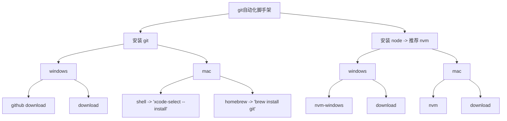
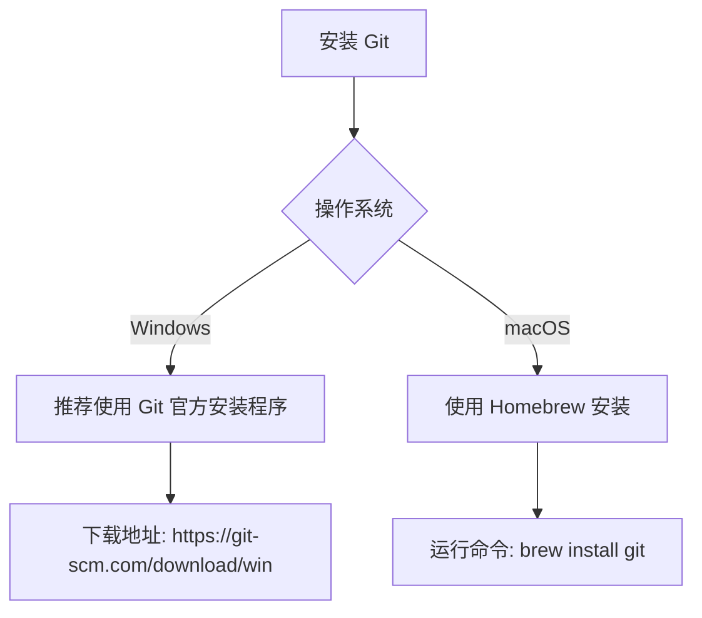

# git自动化脚手架

## 安装 git



## 安装 git 流程图



## 安装 Node.js 流程图

```mermaid
graph TD
    G[安装 Node.js] --> H{操作系统}
    H -->|Windows| I[nvm-windows 版本管理]
    H -->|macOS| J[nvm 版本管理]
    I --> K[下载地址: <https://github.com/coreybutler/nvm-windows/releases>]
    J --> L[安装命令: \n`curl -o- https://raw.githubusercontent.com/nvm-sh/nvm/v0.39.7/install.sh | bash`]
```

## 安装 git 详细说明

### Windows 系统
1. 推荐使用官方安装程序：[Git 官方下载](https://git-scm.com/download/win)
2. 高级用户可选择 [GitHub 源码编译](https://github.com/git/git)

### macOS 系统
推荐使用 Homebrew 安装：
```
brew install git
```

## 安装 node 详细说明

### windows

- [download](https://nodejs.org/zh-cn/download)
- [nvm-windows](https://github.com/coreybutler/nvm-windows)

### mac

- [nvm-mac](https://github.com/nvm-sh/nvm)

## 安装 Node.js 详细说明

### Windows 系统
推荐使用 nvm-windows 版本管理：
1. 下载最新版本：[nvm-windows 发布页](https://github.com/coreybutler/nvm-windows/releases)
2. 解压缩后运行安装程序
3. 通过命令行管理版本：`nvm install 18.16.0`

### macOS 系统
推荐使用 nvm 版本管理：
```bash
# 安装 nvm
curl -o- https://raw.githubusercontent.com/nvm-sh/nvm/v0.39.7/install.sh | bash

# 初始化 nvm
export NVM_DIR="$HOME/.nvm"
[ -s "$NVM_DIR/nvm.sh" ] && \. "$NVM_DIR/nvm.sh"

# 安装 LTS 版本
nvm install --lts
```

