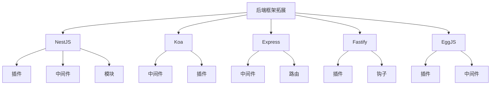

# &nbsp;

# Service 公用扩展支持

后端服务框架拓展是一个基于NestJS、Koa、Express等后端框架的插件、中间件和模块集合，提供了丰富的功能拓展和开发工具。

## 核心特性

- **插件丰富**：提供丰富的后端框架插件
- **中间件支持**：提供各种实用中间件
- **模块化设计**：支持模块化开发和复用
- **多框架支持**：支持NestJS、Koa、Express等多种框架
- **TypeScript**：完整的TypeScript支持
- **可扩展性**：支持自定义扩展和定制

## 快速开始

1. 安装依赖

```bash
cd package-nest
pnpm install
```

2. 启动开发服务器

```bash
pnpm dev
```

## 项目结构



## 文档导航

- [组件概览](/package-nest/overview)
