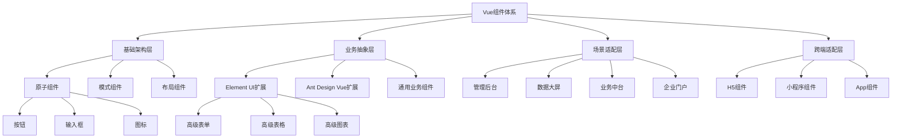

### &nbsp;

# Vue 组件生态体系

本仓库提供基于Vue.js生态的企业级组件库集合，遵循组件设计系统（Design System）规范，支持Vue 2.x与Vue 3.x两套技术栈。涵盖Element UI、Ant Design Vue、UniApp多端适配等多个领域的组件体系，提供丰富的业务组件和原子组件。

## 核心特性

- **双版本兼容性**：基于Composition API与Options API双模态实现，支持Vue 2.x与Vue 3.x
- **TypeScript类型系统**：100%使用TypeScript开发，提供完整的类型定义和IDE智能提示
- **组件设计系统**：遵循Atomic Design原则，从原子组件到复合组件的分层设计
- **多端适配方案**：通过UniApp实现移动端、小程序、H5的统一开发
- **SSR/SSG优化**：针对服务端渲染和静态站点生成的SEO优化组件
- **主题定制系统**：基于CSS变量和Sass/Less的动态主题切换方案

## 组件体系

1. **Element UI体系**

   - 企业管理后台组件库
   - 数据可视化组件
   - 表单复合组件

2. **Ant Design Vue体系**

   - Pro Components组件
   - 业务中台组件
   - 数据大屏组件

3. **UniApp生态**

   - 移动端原子组件
   - 小程序适配组件
   - 跨端表单组件

4. **Pure SEO组件**
   - SSR优化组件
   - 轻量级门户组件
   - 性能优先组件

## 快速开始

1. 安装依赖

```bash
cd package-vue
pnpm install
```

2. 启动组件开发环境

```bash
pnpm dev
```

## 组件架构



## 文档导航

- [快速开始](/package-vue/getting-started)
- [组件指南](/package-vue/components)
- [主题定制](/package-vue/theming)
