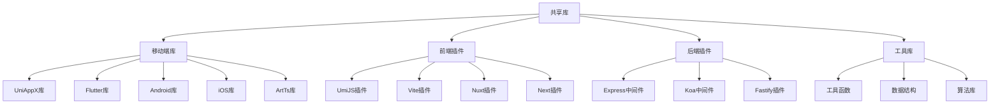

### &nbsp;

# 共享库和通用组件

共享库和通用组件是一个基于Monorepo的现代化共享库集合，提供了丰富的功能和开发工具，包括前端插件、后端插件、移动端组件和通用工具库。

## 核心特性

- **库丰富**：提供丰富的共享库和组件
- **跨平台**：支持Web、移动端等多平台
- **插件系统**：提供各种主流框架的插件
- **类型安全**：完整的TypeScript支持
- **按需引入**：支持按需引入和Tree Shaking
- **文档完善**：详细的API文档和使用示例

## 快速开始

1. 安装依赖

```bash
cd packages
pnpm install
```

2. 启动开发服务器

```bash
pnpm dev
```

## 项目结构



## 文档导航

- [工具指南](./docs/overview)
- [API参考](./docs/api)
