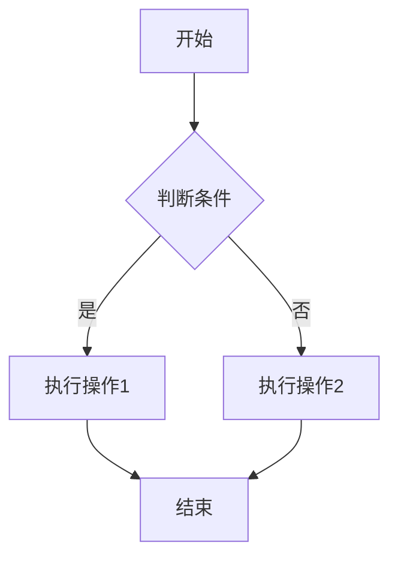

# vitepress-plugin-smart

> 为 VitePress 提供一站式智能功能集成的插件，当前集成了 Mermaid 图表支持

## 功能特性

- ✅ 完全集成 [vitepress-plugin-mermaid](https://github.com/emersonbottero/vitepress-plugin-mermaid)，支持 Mermaid 图表
- ✅ 简化配置，统一管理多个插件功能
- ✅ 支持配置选项开关功能
- ✅ 同时支持 ESM 和 CommonJS 模块系统
- ✅ 提供同步和异步 API

## 安装

```bash
# npm
npm install vitepress-plugin-smart --save-dev

# yarn
yarn add vitepress-plugin-smart -D

# pnpm
pnpm add vitepress-plugin-smart -D
```

## 使用方法

### 在 ESM 环境中使用（推荐）

在 VitePress 配置文件中导入并使用插件：

```ts
// .vitepress/config.ts
import { defineConfig } from 'vitepress'
import { withSmart } from 'vitepress-plugin-smart'

export default async function config() {
  return withSmart(
    defineConfig({
      // VitePress 基础配置
      title: '我的文档',
      description: '使用 VitePress 构建的文档站点',
      // 其他配置...
    }),
    {
      // Smart 插件选项
      mermaid: {
        // 是否启用 mermaid 功能，默认为 true
        enable: true,
        // mermaid 配置项
        config: {
          theme: 'neutral',
          // 更多 mermaid 配置选项...
        },
      },
    },
  )
}
```

### 在 CommonJS 环境中使用

如果您的项目使用 CommonJS 模块系统，可以使用同步 API：

```js
// .vitepress/config.js
const { defineConfig } = require('vitepress')
const { withSmartSync } = require('vitepress-plugin-smart')
const { withMermaid } = require('vitepress-plugin-mermaid')

// 使用同步API需要手动应用withMermaid
module.exports = withMermaid(
  withSmartSync(
    defineConfig({
      // VitePress 基础配置
      title: '我的文档',
      description: '使用 VitePress 构建的文档站点',
      // 其他配置...
    }),
    {
      // Smart 插件选项
      mermaid: {
        enable: true,
        config: {
          theme: 'neutral',
        },
      },
    },
  ),
)
```

## Mermaid 图表使用

安装配置好插件后，你可以在 Markdown 文件中使用 Mermaid 图表语法：

````markdown

````

## API 参考

### withSmart(config, options?)

异步主插件函数，用于增强 VitePress 配置。

- `config`: VitePress 配置对象
- `options`: 插件选项
  - `mermaid`: Mermaid 插件选项
    - `enable`: 是否启用 Mermaid 功能，默认为 `true`
    - `config`: Mermaid 配置选项，详见 [Mermaid 配置文档](https://mermaid.js.org/config/setup/modules/mermaidAPI.html#mermaidapi-configuration-defaults)

### withSmartSync(config, options?)

同步版本的主插件函数，用于在 CommonJS 环境中使用。注意：此函数不会自动应用 withMermaid，需要手动组合使用。

### withMermaid(config)

异步函数，用于向后兼容，直接包装了 vitepress-plugin-mermaid 提供的同名函数。

## 模块兼容性

由于 `vitepress-plugin-mermaid` 是 ESM 模块，而本插件需要同时支持 ESM 和 CommonJS，所以：

1. 在 ESM 环境中，推荐使用异步 API `withSmart`
2. 在 CommonJS 环境中，使用 `withSmartSync` 并手动应用 `withMermaid`

## 贡献指南

欢迎贡献代码、报告问题或提出改进建议。

## 许可证

ISC
