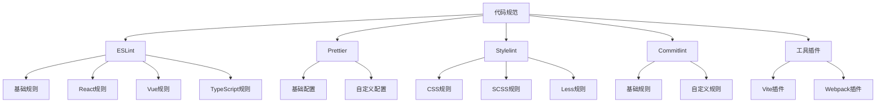

# 代码规范、质量检测、代码风格、提交规范等统一管理

代码规范是一个基于ESLint、Prettier、Stylelint等工具的现代化代码规范解决方案，提供了完整的代码质量检测、代码风格统一和提交规范管理。

## 核心特性

- **代码质量**：基于ESLint的代码质量检查
- **代码风格**：基于Prettier的代码格式化
- **样式规范**：基于Stylelint的样式规范
- **提交规范**：基于Commitlint的提交规范
- **工具集成**：提供Vite、Webpack等构建工具的插件
- **配置共享**：支持团队间共享配置

## 快速开始

1. 安装依赖

```bash
cd lint
pnpm install
```

2. 配置规范

```bash
pnpm lint:init
```

## 项目结构



## 文档导航

- [规范总览](/lint/overview)
- [快速开始](/lint/getting-started)
