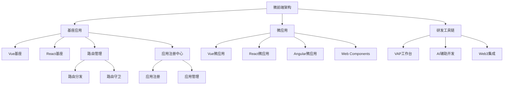

# &nbsp;

# 微前端架构模板

微前端（Micro-Frontends）是一种前端架构模式，将前端应用解耦为多个自治的微应用，每个微应用可独立开发、测试和部署。本目录集成了多种微前端实现方案和前端框架模板，包括基于Web Components的MicroApp、React、Vue、Angular等，并提供了工程化研发工作台支持。

## 核心特性

- **技术栈无关性**：支持Vue、React、Angular等多种框架共存，实现技术栈自由选择
- **独立部署与CI/CD**：每个微应用可独立构建与发布，支持灰度发布与A/B测试
- **沙箱隔离**：通过JavaScript沙箱和样式隔离确保微应用间不相互影响
- **预加载与懒加载**：支持应用按需/预加载策略，优化首屏体验
- **状态管理隔离**：微应用间状态管理独立，支持跨应用通信机制
- **研发工作台**：集成VAP（Visual Assisted Programming）可视化辅助编程工具链

## 快速开始

1. 安装依赖

```bash
cd micro-frontend
pnpm install
```

2. 启动开发服务器

```bash
pnpm dev
```

## 架构设计



## 文档导航

- [快速开始](/micro-frontend/getting-started)
- [架构设计](/micro-frontend/architecture)
