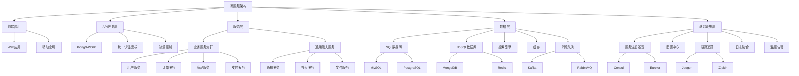

# &nbsp;

# 企业级微服务架构平台

> 构建可扩展、高性能、弹性的分布式系统

本平台提供完整的微服务架构解决方案，融合领域驱动设计思想与云原生技术栈，支持构建现代化的分布式应用系统。通过标准化的服务治理机制，降低微服务开发、测试与运维的复杂性。

## 核心能力

- **领域驱动的服务拆分**：基于业务领域和限界上下文的服务边界设计，保证服务高内聚低耦合
- **多种通信模式**：支持同步(REST、gRPC)与异步(消息、事件)通信模式，满足不同场景需求
- **分布式事务管理**：基于Saga模式的长事务处理与最终一致性保证
- **服务弹性设计**：熔断、限流、重试、降级等弹性设计模式的标准化实现
- **可观测性支持**：分布式链路追踪、日志聚合、指标监控的三维可观测性方案
- **API生命周期管理**：API版本化、契约测试、兼容性保障、文档自动化生成

## 快速开始

### 微服务项目初始化

```bash
# 安装微服务CLI工具
pnpm micro-service:install

# 创建新的微服务项目
pnpm micro-service:create --lang=java --framework=spring-boot --template=ddd-hex

# 运行本地开发环境
pnpm micro-service:dev
```

### 微服务领域模型示例

```java
// 领域模型示例 - 聚合根
@Aggregate
public class Order {
    @AggregateIdentifier
    private OrderId id;
    private CustomerId customerId;
    private Money totalAmount;
    private OrderStatus status;
    private Set<OrderLine> orderLines;

    // 工厂方法
    public static Order createOrder(CustomerId customerId, Set<OrderLine> orderLines) {
        Order order = new Order();
        order.id = new OrderId(UUID.randomUUID().toString());
        order.customerId = customerId;
        order.orderLines = orderLines;
        order.status = OrderStatus.CREATED;
        order.calculateTotalAmount();

        // 发布领域事件
        order.registerEvent(new OrderCreatedEvent(order.id, order.customerId, order.totalAmount));
        return order;
    }

    // 业务行为
    public void confirmOrder() {
        if (this.status != OrderStatus.CREATED) {
            throw new IllegalStateException("Order cannot be confirmed in status: " + this.status);
        }
        this.status = OrderStatus.CONFIRMED;
        this.registerEvent(new OrderConfirmedEvent(this.id));
    }

    // 计算订单总金额
    private void calculateTotalAmount() {
        this.totalAmount = orderLines.stream()
            .map(line -> line.getPrice().multiply(line.getQuantity()))
            .reduce(Money.ZERO, Money::add);
    }
}
```

### 微服务API定义示例

```protobuf
syntax = "proto3";

package com.example.order;

option java_multiple_files = true;
option java_package = "com.example.order.grpc";

service OrderService {
  // 创建订单
  rpc CreateOrder(CreateOrderRequest) returns (CreateOrderResponse);

  // 确认订单
  rpc ConfirmOrder(ConfirmOrderRequest) returns (ConfirmOrderResponse);

  // 查询订单
  rpc GetOrder(GetOrderRequest) returns (GetOrderResponse);

  // 查询用户订单列表
  rpc ListOrdersByCustomer(ListOrdersByCustomerRequest) returns (ListOrdersByCustomerResponse);
}

message CreateOrderRequest {
  string customer_id = 1;
  repeated OrderLineDto order_lines = 2;
}

message OrderLineDto {
  string product_id = 1;
  int32 quantity = 2;
  MoneyDto price = 3;
}

message MoneyDto {
  string currency_code = 1;
  int64 amount = 2;
}

message CreateOrderResponse {
  string order_id = 1;
  OrderStatus status = 2;
}

enum OrderStatus {
  CREATED = 0;
  CONFIRMED = 1;
  PAID = 2;
  SHIPPED = 3;
  DELIVERED = 4;
  CANCELLED = 5;
}

// ... 其他消息定义
```

## 微服务架构图



## 文档导航

- [微服务架构概述](/micro-service/architecture)
- [领域驱动设计实践](/micro-service/ddd-practice)
- [服务拆分策略](/micro-service/service-decomposition)
- [API设计规范](/micro-service/api-design)
- [微服务通信模式](/micro-service/communication-patterns)
- [分布式事务](/micro-service/distributed-transactions)
- [微服务测试策略](/micro-service/testing-strategy)
- [服务治理最佳实践](/micro-service/governance)
