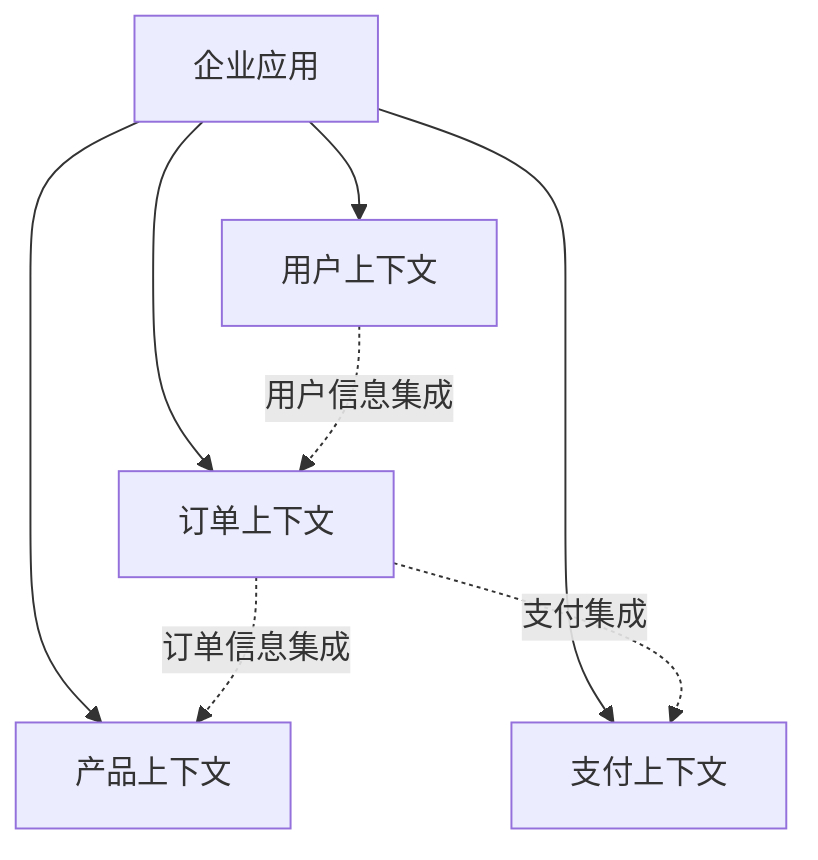

# 领域驱动设计在微服务中的实践

领域驱动设计(Domain-Driven Design, DDD)是一种软件开发方法论，特别适用于构建复杂的微服务架构系统。本文档介绍如何在微服务环境中应用DDD核心概念和实践技术。

## DDD核心概念

### 战略设计(Strategic Design)

战略设计关注系统的整体结构和服务边界划分，是微服务架构设计的基础。

#### 限界上下文(Bounded Context)

限界上下文是一个明确定义的边界，在这个边界内，特定模型和术语具有一致的含义。在微服务架构中，每个微服务通常对应一个或多个限界上下文。



#### 上下文映射(Context Mapping)

上下文映射描述了不同限界上下文之间的关系和集成方式。在微服务架构中，这些映射关系通常通过API调用、事件发布/订阅或共享内核实现。

常见的上下文映射模式包括：

- **共享内核(Shared Kernel)**: 两个上下文共享一部分模型和代码
- **客户-供应商(Customer-Supplier)**: 上下文之间有上下游依赖关系
- **合作者(Partnership)**: 两个上下文相互依赖，共同发展
- **防腐层(Anticorruption Layer)**: 隔离外部模型，避免概念污染
- **开放主机服务(Open Host Service)**: 提供标准化API供多个消费者使用
- **发布语言(Published Language)**: 定义通用交换语言，用于上下文间通信

#### 子域(Subdomain)

子域是业务领域的一个部分，可以分为三类：

- **核心域(Core Domain)**: 组织的核心竞争力所在，需要大量投入
- **支撑子域(Supporting Subdomain)**: 支持核心业务，但不是核心竞争力
- **通用子域(Generic Subdomain)**: 没有特殊性，可以外包或使用现成解决方案

在微服务架构中，我们通常为核心域创建独立的微服务，而支撑子域和通用子域可能会合并或使用第三方服务。

### 战术设计(Tactical Design)

战术设计聚焦于单个限界上下文内的实现细节，关注领域模型的构建。

#### 实体(Entity)

具有唯一标识符和生命周期的领域对象。在微服务中，实体通常映射为数据库中的记录。

```typescript
// NestJS中的实体示例
@Entity()
export class Order {
  @PrimaryGeneratedColumn('uuid')
  id: string;
  
  @Column()
  customerId: string;
  
  @Column('decimal')
  totalAmount: number;
  
  @Column({ type: 'enum', enum: OrderStatus })
  status: OrderStatus;
  
  @OneToMany(() => OrderItem, item => item.order)
  items: OrderItem[];
  
  // 领域行为
  placeOrder(): void {
    if (this.items.length === 0) {
      throw new Error('Order must have at least one item');
    }
    this.status = OrderStatus.PLACED;
  }
  
  cancel(): void {
    if (this.status === OrderStatus.SHIPPED) {
      throw new Error('Cannot cancel shipped order');
    }
    this.status = OrderStatus.CANCELLED;
  }
}
```

#### 值对象(Value Object)

描述领域特征且没有唯一标识的对象。值对象是不可变的，基于属性而非身份进行相等比较。

```typescript
// 值对象示例
export class Address {
  constructor(
    readonly street: string,
    readonly city: string,
    readonly state: string,
    readonly zipCode: string,
    readonly country: string
  ) {}
  
  equals(other: Address): boolean {
    return this.street === other.street &&
           this.city === other.city &&
           this.state === other.state &&
           this.zipCode === other.zipCode &&
           this.country === other.country;
  }
  
  toString(): string {
    return `${this.street}, ${this.city}, ${this.state} ${this.zipCode}, ${this.country}`;
  }
}
```

#### 聚合(Aggregate)

聚合是一组相关对象的集合，作为一个整体来维护业务规则和不变量。每个聚合有一个根实体，所有外部引用都必须通过根实体进行。

在微服务架构中，聚合是一个重要的概念，因为它定义了事务和一致性边界。

```typescript
// 聚合根示例
@Entity()
export class ShoppingCart {
  @PrimaryGeneratedColumn('uuid')
  id: string;
  
  @Column()
  customerId: string;
  
  @OneToMany(() => CartItem, item => item.cart, { cascade: true })
  items: CartItem[];
  
  // 领域行为和业务规则
  addItem(productId: string, quantity: number): void {
    const existingItem = this.items.find(item => item.productId === productId);
    
    if (existingItem) {
      existingItem.increaseQuantity(quantity);
    } else {
      const newItem = new CartItem(this, productId, quantity);
      this.items.push(newItem);
    }
  }
  
  removeItem(productId: string): void {
    this.items = this.items.filter(item => item.productId !== productId);
  }
  
  calculateTotal(): number {
    return this.items.reduce((sum, item) => sum + item.calculateSubtotal(), 0);
  }
}
```

#### 领域服务(Domain Service)

领域服务封装了不适合放在单个实体或值对象中的领域逻辑，尤其是涉及多个实体的操作。

```typescript
// 领域服务示例
@Injectable()
export class OrderProcessingService {
  constructor(
    private readonly inventoryRepository: InventoryRepository,
    private readonly orderRepository: OrderRepository
  ) {}
  
  async processOrder(order: Order): Promise<void> {
    // 验证库存
    for (const item of order.items) {
      const inventory = await this.inventoryRepository.findByProductId(item.productId);
      if (!inventory.hasAvailableStock(item.quantity)) {
        throw new InsufficientStockException(item.productId);
      }
    }
    
    // 扣减库存
    for (const item of order.items) {
      const inventory = await this.inventoryRepository.findByProductId(item.productId);
      inventory.reduceStock(item.quantity);
      await this.inventoryRepository.save(inventory);
    }
    
    // 确认订单
    order.confirm();
    await this.orderRepository.save(order);
  }
}
```

#### 资源库(Repository)

资源库负责持久化和检索聚合根，隐藏存储和查询的细节。

```typescript
// 资源库接口
export interface OrderRepository {
  findById(id: string): Promise<Order | null>;
  findByCustomerId(customerId: string): Promise<Order[]>;
  save(order: Order): Promise<void>;
  delete(order: Order): Promise<void>;
}

// TypeORM实现
@Injectable()
export class TypeOrmOrderRepository implements OrderRepository {
  constructor(
    @InjectRepository(Order)
    private readonly orderEntityRepository: Repository<Order>
  ) {}
  
  async findById(id: string): Promise<Order | null> {
    return this.orderEntityRepository.findOne({
      where: { id },
      relations: ['items']
    });
  }
  
  async findByCustomerId(customerId: string): Promise<Order[]> {
    return this.orderEntityRepository.find({
      where: { customerId },
      relations: ['items']
    });
  }
  
  async save(order: Order): Promise<void> {
    await this.orderEntityRepository.save(order);
  }
  
  async delete(order: Order): Promise<void> {
    await this.orderEntityRepository.remove(order);
  }
}
```

## 在微服务中应用DDD

### 基于DDD划分微服务边界

1. **从业务能力出发**：根据业务能力而非技术组件划分服务
2. **遵循限界上下文**：一个微服务应该对应一个或少数几个紧密相关的限界上下文
3. **考虑数据一致性需求**：需要强一致性的数据应该位于同一个微服务中
4. **识别聚合边界**：一个聚合应当完全位于一个微服务中

### 事件驱动架构与DDD

在微服务架构中，事件驱动通信是实现领域事件和服务解耦的关键：

```typescript
// 领域事件
export class OrderPlacedEvent {
  constructor(
    public readonly orderId: string,
    public readonly customerId: string,
    public readonly amount: number,
    public readonly items: Array<{ productId: string, quantity: number }>
  ) {}
}

// 发布领域事件
@Injectable()
export class OrderService {
  constructor(
    private readonly orderRepository: OrderRepository,
    private readonly eventBus: EventBus
  ) {}
  
  async placeOrder(order: Order): Promise<void> {
    // 处理订单逻辑
    order.placeOrder();
    await this.orderRepository.save(order);
    
    // 发布领域事件
    this.eventBus.publish(new OrderPlacedEvent(
      order.id,
      order.customerId,
      order.totalAmount,
      order.items.map(item => ({
        productId: item.productId,
        quantity: item.quantity
      }))
    ));
  }
}

// 订阅领域事件
@EventsHandler(OrderPlacedEvent)
export class InventoryHandler implements IEventHandler<OrderPlacedEvent> {
  constructor(private readonly inventoryService: InventoryService) {}
  
  async handle(event: OrderPlacedEvent) {
    // 处理库存逻辑
    await this.inventoryService.reserveStock(event.items);
  }
}
```

### 命令查询职责分离(CQRS)

CQRS将读操作(查询)和写操作(命令)分离，是DDD在微服务架构中的常见模式：

```typescript
// 命令处理器
@CommandHandler(CreateOrderCommand)
export class CreateOrderHandler implements ICommandHandler<CreateOrderCommand> {
  constructor(private readonly orderRepository: OrderRepository) {}
  
  async execute(command: CreateOrderCommand): Promise<void> {
    const order = new Order(
      command.customerId,
      command.items.map(item => new OrderItem(item.productId, item.price, item.quantity))
    );
    
    order.calculateTotal();
    await this.orderRepository.save(order);
  }
}

// 查询处理器
@QueryHandler(GetOrdersQuery)
export class GetOrdersHandler implements IQueryHandler<GetOrdersQuery> {
  constructor(
    @InjectRepository(OrderReadModel)
    private readonly orderReadModelRepository: Repository<OrderReadModel>
  ) {}
  
  async execute(query: GetOrdersQuery): Promise<OrderDto[]> {
    const orders = await this.orderReadModelRepository.find({
      where: { customerId: query.customerId },
      relations: ['items']
    });
    
    return orders.map(order => ({
      id: order.id,
      customerId: order.customerId,
      status: order.status,
      totalAmount: order.totalAmount,
      createdAt: order.createdAt,
      items: order.items.map(item => ({
        productId: item.productId,
        productName: item.productName,
        price: item.price,
        quantity: item.quantity
      }))
    }));
  }
}
```

### 防腐层

防腐层是隔离外部系统与核心域的关键模式：

```typescript
// 防腐层示例 - 隔离第三方支付系统
@Injectable()
export class PaymentServiceAdapter {
  constructor(
    private readonly paypalClient: PaypalClient,
    private readonly stripeClient: StripeClient,
    private readonly configService: ConfigService
  ) {}
  
  async processPayment(payment: Payment): Promise<PaymentResult> {
    // 根据配置决定使用哪个支付提供商
    const provider = this.configService.get('PAYMENT_PROVIDER');
    
    if (provider === 'PAYPAL') {
      const paypalResult = await this.paypalClient.charge({
        amount: payment.amount,
        currency: payment.currency,
        source: payment.paymentMethodId,
        description: `Payment for order ${payment.orderId}`
      });
      
      return {
        successful: paypalResult.status === 'COMPLETED',
        transactionId: paypalResult.id,
        errorMessage: paypalResult.error_message
      };
    } else {
      const stripeResult = await this.stripeClient.createCharge({
        amount: Math.round(payment.amount * 100), // Stripe使用分为单位
        currency: payment.currency.toLowerCase(),
        source: payment.paymentMethodId,
        description: `Payment for order ${payment.orderId}`
      });
      
      return {
        successful: stripeResult.status === 'succeeded',
        transactionId: stripeResult.id,
        errorMessage: stripeResult.failure_message
      };
    }
  }
}
```

## 微服务中的DDD最佳实践

1. **保持微服务的自治**
   - 每个微服务拥有自己的领域模型和数据存储
   - 避免跨微服务的事务
   - 使用异步通信减少耦合

2. **关注领域建模**
   - 与领域专家紧密合作
   - 开发通用语言(Ubiquitous Language)
   - 优先考虑领域逻辑，而非技术细节

3. **使用限界上下文划分服务**
   - 明确定义每个服务的边界和职责
   - 确保服务内模型的统一性和一致性
   - 谨慎设计上下文之间的集成

4. **使用事件驱动架构**
   - 通过领域事件实现微服务间的通信
   - 实现最终一致性，而非强一致性
   - 考虑事件溯源(Event Sourcing)

5. **合理设计聚合边界**
   - 保持聚合小而内聚
   - 一个事务只应修改一个聚合
   - 通过领域事件处理跨聚合操作

## 案例研究：电子商务系统

一个典型的电子商务系统可能包含以下限界上下文，每个上下文可以对应一个微服务：

1. **目录上下文(Catalog Context)**
   - 产品信息管理
   - 分类管理
   - 搜索和发现

2. **客户上下文(Customer Context)**
   - 用户注册和管理
   - 客户资料
   - 偏好设置

3. **订单上下文(Order Context)**
   - 订单处理
   - 订单状态管理
   - 订单历史

4. **购物车上下文(Cart Context)**
   - 购物车管理
   - 促销应用
   - 价格计算

5. **支付上下文(Payment Context)**
   - 支付方式管理
   - 支付处理
   - 退款处理

6. **库存上下文(Inventory Context)**
   - 库存管理
   - 补货
   - 预留管理

这些上下文之间通过事件和API进行集成，例如：

- 当客户下单时，订单上下文发布`OrderPlaced`事件
- 库存上下文监听该事件并减少相应的库存
- 支付上下文监听该事件并处理付款
- 当支付成功时，支付上下文发布`PaymentCompleted`事件
- 订单上下文监听该事件并更新订单状态

这种基于DDD和事件驱动的设计，使得各微服务可以独立演化，同时保持系统整体的一致性和可靠性。

## 结论

领域驱动设计为微服务架构提供了强大的战略和战术工具，帮助我们设计出更加符合业务需求、更具弹性和可维护性的系统。通过正确应用DDD原则，我们可以创建真正反映业务领域的微服务架构，实现业务与技术的有效对接。 