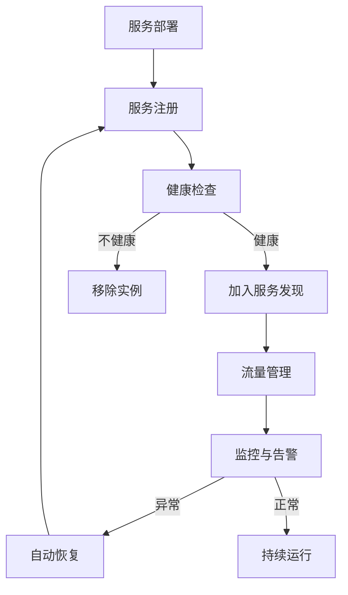

# 微服务服务治理

微服务架构中的服务治理是确保微服务生态系统健康、可靠和高效运行的关键环节。本文档提供了服务治理的核心概念和最佳实践。

## 服务治理的核心领域

### 服务注册与发现

- **服务注册中心**: 使用 Consul 作为服务注册中心，实现服务的动态注册和发现
- **健康检查**: 定期检查服务实例的健康状态，自动移除不健康的实例
- **负载均衡**: 结合 gRPC 和 Consul 实现客户端负载均衡

### 流量控制

- **熔断机制**: 使用熔断器模式防止级联故障
- **限流策略**: 实现基于令牌桶的请求速率限制
- **降级策略**: 在高负载情况下的服务降级方案

### 监控与可观测性

- **分布式追踪**: 使用 OpenTelemetry 进行请求追踪
- **日志聚合**: ELK 日志聚合方案
- **指标监控**: Prometheus + Grafana 监控方案
- **告警策略**: 基于 Alertmanager 的多级告警方案

### 配置管理

- **中心化配置**: 基于 Consul KV 的配置中心
- **动态配置刷新**: 服务配置热更新机制
- **配置版本管理**: 配置的版本控制和回滚策略

## 最佳实践

1. **服务定义标准化**: 统一服务定义格式，包括服务名、版本、标签等
2. **自愈能力**: 设计具有自动恢复能力的服务
3. **容错设计**: 实现优雅降级和故障隔离
4. **统一治理平台**: 提供可视化的服务治理控制台

## 治理工具链

| 领域 | 工具 | 用途 |
|-----|-----|------|
| 服务注册发现 | Consul | 服务注册、发现、KV存储 |
| API网关 | Envoy | 外部流量入口、路由、鉴权 |
| 监控 | Prometheus + Grafana | 指标收集和可视化 |
| 日志 | ELK Stack | 日志收集、索引和分析 |
| 追踪 | OpenTelemetry | 分布式追踪 |
| 流量控制 | Sentinel | 流量控制、熔断、降级 |

## 服务治理流程

