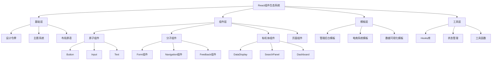

# React生态组件库

> 基于组件驱动开发(CDD)理念打造的企业级React UI系统，提供从设计规范到实现的完整解决方案

本项目构建了一套全面的React组件生态系统，采用原子设计(Atomic Design)方法论组织组件结构，支持多种渲染模式和框架集成，为企业级应用提供高质量、高性能、高可维护的UI解决方案。

## 核心技术特性

- **组件驱动开发(CDD)**: 基于Storybook实现组件优先开发流程，实现设计、开发、测试和文档的紧密协作
- **自适应渲染策略**: 支持客户端渲染(CSR)、服务端渲染(SSR)、静态生成(SSG)和增量静态再生成(ISR)等多种渲染模式
- **Concurrent Mode支持**: 充分利用React 18的并发特性，如Suspense、useTransition和useDeferredValue，实现流畅的用户体验
- **主题系统与样式解决方案**: 基于CSS-in-JS(Emotion/Styled Components)和CSS变量构建可扩展的主题系统，支持暗黑模式和品牌定制
- **可访问性(A11y)优化**: 符合WCAG AA级标准，通过键盘导航、屏幕阅读器支持和高对比度模式增强应用可访问性
- **跨框架集成**: 支持与Next.js、Remix、Gatsby等React框架的无缝集成，以及部分组件的React Native适配

## 快速开始

### 安装

```bash
# 使用npm
npm install @fullstack/react-ui @fullstack/react-hooks @fullstack/react-utils

# 使用pnpm
pnpm add @fullstack/react-ui @fullstack/react-hooks @fullstack/react-utils
```

### 基本使用

```tsx
import { Button, Card, TextField } from '@fullstack/react-ui';
import { useForm } from '@fullstack/react-hooks';

function LoginForm() {
  const { values, handleChange, handleSubmit } = useForm({
    initialValues: { email: '', password: '' },
    onSubmit: values => console.log(values),
  });

  return (
    <Card elevation="md" padding="lg">
      <form onSubmit={handleSubmit}>
        <TextField
          label="邮箱"
          name="email"
          value={values.email}
          onChange={handleChange}
          required
        />
        <TextField
          label="密码"
          name="password"
          type="password"
          value={values.password}
          onChange={handleChange}
          required
        />
        <Button variant="primary" type="submit">
          登录
        </Button>
      </form>
    </Card>
  );
}
```

## 组件架构图



## 文档导航

- [快速开始](/package-react/getting-started)
- [组件指南](/package-react/components)
- [主题定制](/package-react/theming)
